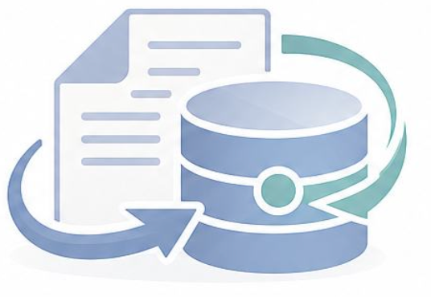
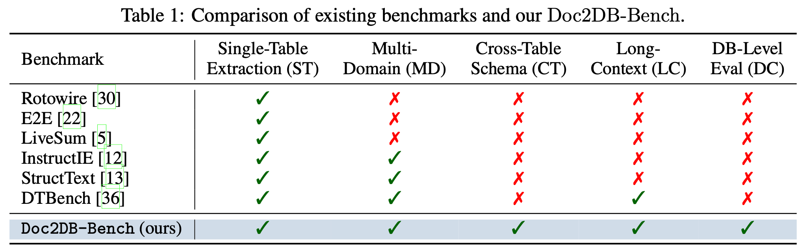
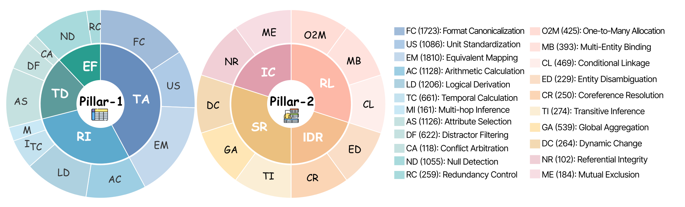
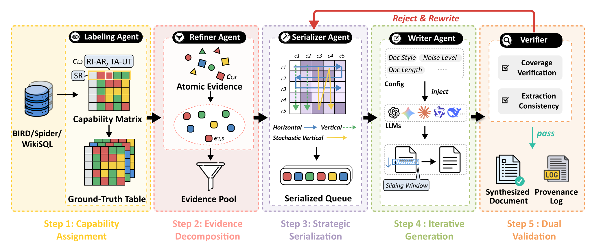
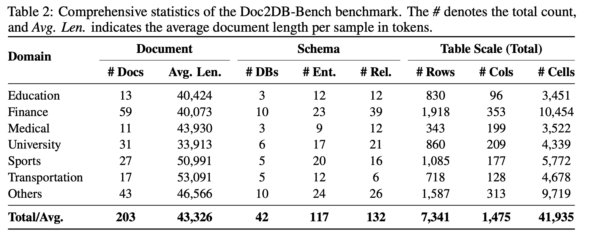
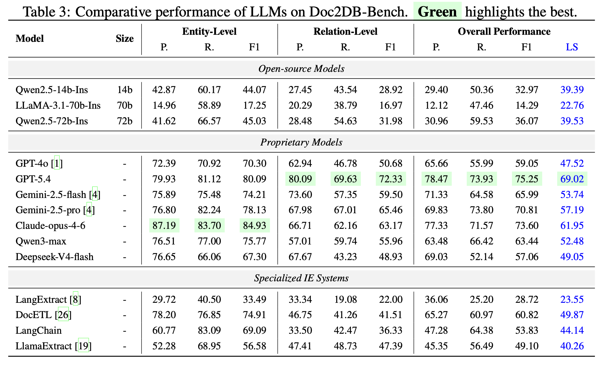
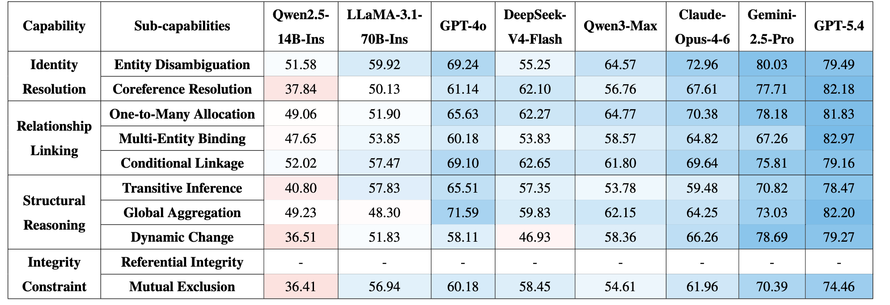

<div align="center">
  <h1>
    
    Beyond Tables: Doc2DB-Bench for Relationally Faithful Document-to-Database Construction
  </h1>
</div>


<div align="center">

[](https://arxiv.org/abs/2603.29232)
[](https://huggingface.co/SetonLiang2/LiteCoST/)
[](https://www.python.org/downloads/release/python-31110/)

</div>

## 👀Overview

Doc2DB-Bench is a benchmark for evaluating **document-to-database construction** rather than flat document-to-table extraction. It targets realistic settings where long documents must be converted into normalized relational databases with entity identities, keys, cross-table links, and integrity constraints.

The benchmark is built with a controllable **DB2Doc reverse-synthesis** pipeline grounded in real relational databases, and it is organized by a two-pillar capability taxonomy covering both **intra-table extraction** and **inter-table relational reasoning**. The current release contains **203 long-document instances** across **42 schemas** and **7 domains**, with **117 entity tables**, **132 relationship tables**, **7,341 rows**, and **41,935 cells**.

### ❓Why Doc2DB-Bench

Most existing document extraction benchmarks stop at a single flattened table. That is insufficient for downstream systems that need:

- normalized schemas instead of denormalized records
- stable entity identities and keys
- relation tables and foreign-key alignment
- global consistency across multiple tables
- database-level validation rather than isolated cell matching

Doc2DB-Bench is designed to measure exactly those requirements.

### ✨Benchmark Highlights

- **Beyond single-table extraction**: evaluates full relational database reconstruction.
- **Fine-grained capability design**: separates local value extraction from cross-table reasoning.
- **Controllable synthesis**: generates benchmark instances from real databases while controlling capability coverage.
- **Database-level evaluation**: measures entity integrity and relational fidelity together.
- **Authenticity checks**: synthesized documents are validated against real-world references for realism.

<p align="center">
  
</p>

## 📰News

`[2026-07-28]` 🔥The code and benchmark are releasing. If you encounter any issues, please feel free to contact us.

## 🧱Capability Taxonomy

<p align="center">
  
</p>

Doc2DB-Bench is organized around two top-level capability pillars.

### 1. Intra-Table Capabilities

These cover cell-level extraction and transformation within a table, including value normalization, semantic alignment, inference, disambiguation, and factual faithfulness.

### 2. Inter-Table Capabilities

These cover database-specific reasoning across tables, including:

- identity resolution
- relationship linking
- multi-hop composition
- dynamic change reasoning
- integrity constraint preservation

This split is central to both dataset construction and evaluation.

## 🏗️DB2Doc Reverse-Synthesis Pipeline

<p align="center">
  
</p>

The benchmark instances are generated from real databases through a controllable reverse pipeline. At a high level, the process is:

1. assign capabilities to schema fields and relations
2. collect or refine supporting evidence
3. serialize evidence into document writing units
4. generate long-form documents
5. validate the generated documents against the source database

This pipeline is implemented in [`data_construction/`](./data_construction/), where the codebase provides preprocessing, synthesis, validation, OCR utilities, and runtime configuration.


## 📊Dataset Statistics

<p align="center">
  
</p>

Doc2DB-Bench contains **203** long-document instances built from **42** databases across **7** domains, covering **117** entity tables, **132** relationship tables, **7,341** rows, **1,475** columns, and **41,935** cells, with an average document length of **43,326** tokens and fine-grained capability annotations on **11,205** cells and **3,129** rows.

## 🏆Leaderboard

<p align="center">
  
</p>


The paper evaluates a range of proprietary and open-source LLMs on Doc2DB-Bench.

### Main findings

- **GPT-5.4** achieves the best overall F1 and the best LLM-based consistency score reported in the paper.
- **Claude-opus-4-6** shows the strongest entity-level F1.
- **GPT-5.4** also achieves the best relation-level F1, indicating stronger global alignment and relational reasoning.
- Proprietary reasoning-oriented models consistently outperform smaller or less reasoning-focused open models on this benchmark.

> The core takeaway is that **relational reasoning remains the main bottleneck**: relation extraction is substantially harder than entity extraction, even when entity tables are provided under oracle settings.


<p align="center">
  
</p>

### Capability Findings

- Capability-annotated documents are consistently harder than unlabeled ones, especially at the entity level.
- **GPT-5.4** performs best across the fine-grained capability categories.
- Implicit evidence aggregation and multi-step structural reasoning create the largest gaps between strong and weak models.
- Integrity-constraint verification remains weak across models, especially for referential integrity and mutual exclusion.


## 🗂️Repository Structure

```text
Doc2DB-Bench/
├── README.md
├── doc2db-bench.pdf
├── app.py
├── assets/
├── dataset/
├── llm/
├── data_construction/
│   ├── README.md
│   ├── README_ZH.md
│   ├── run_demo.py
│   ├── ocr.py
│   └── src/
└── evaluation/
    ├── README.md
    ├── README_ZH.md
    ├── test_dataset_evaluate.py
    ├── llm_evaluate_cascade.py
    ├── docetl_evaluate.py
    ├── langchain_evaluate.py
    ├── langextract_evaluate.py
    └── docqa/
```

## 🧩What Each Module Does

1. [`data_construction/`](./data_construction/): Implements the benchmark construction pipeline:

- preprocess Spider / BIRD databases
- assign capability labels
- refine evidence
- serialize writing tasks
- generate long-form documents
- validate document-to-database faithfulness
- run OCR for reference documents

See [`data_construction/README.md`](./data_construction/README.md) for the detailed pipeline, configuration, supported input formats, and scripts.

2. [`evaluation/`](./evaluation/): Implements structured extraction baselines and evaluation:

- run extraction baselines
- score outputs against ground-truth database tables
- produce fine-grained analysis notebooks
- run DocQA-style evaluation for generated documents

See [`evaluation/README.md`](./evaluation/README.md) for baseline usage, metric definitions, output files, and notebook-based analysis.

## 🚀Getting Started

If you want to work from the benchmark implementation, the practical entry points are:

1. read [`data_construction/README.md`](./data_construction/README.md) to understand the DB2Doc synthesis pipeline
2. read [`evaluation/README.md`](./evaluation/README.md) to understand the extraction baselines and evaluation workflow


<!-- ## Paper and Assets -->
<!-- - Paper PDF: [`doc2db-bench.pdf`](./doc2db-bench.pdf) -->
<!-- - OpenReview: <https://openreview.net/forum?id=faECRsdRav> -->
<!-- - arXiv: <https://arxiv.org/abs/2603.29232> -->
<!-- - Model: <https://huggingface.co/SetonLiang2/LiteCoST/> -->
