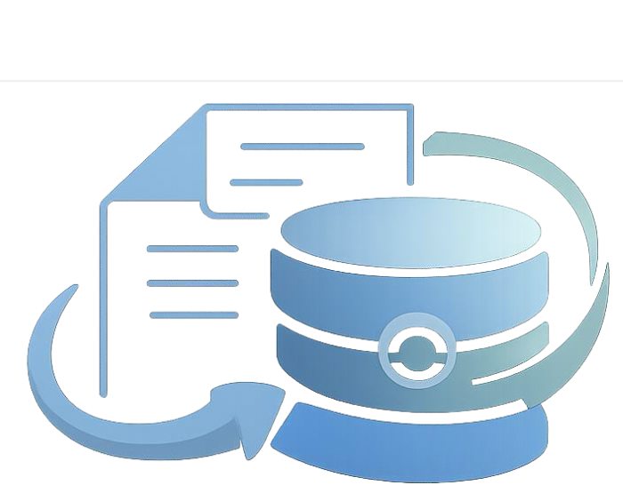

<div align="center"><h1>Beyond Tables: Doc2DB-Bench for Relationally Faithful Document-to-Database Construction</h1></div>


## 👀Overview

$\color{#2F5F8F}\mathbf{Doc2DB{-}Bench}$ is a benchmark for evaluating **document-to-database construction** rather than flat document-to-table extraction. It targets realistic settings where long documents must be converted into normalized relational databases with entity identities, keys, cross-table links, and integrity constraints.

The benchmark is built with a controllable **DB2Doc reverse-synthesis** pipeline grounded in real relational databases, and it is organized by a two-pillar capability taxonomy covering both **intra-table extraction** and **inter-table relational reasoning**. The current release contains **203 long-document instances** across **42 schemas** and **7 domains**, with **117 entity tables**, **132 relationship tables**, **7,341 rows**, and **41,935 cells**.


## 🗂️Repository Structure

```text
Doc2DB-Bench/
├── README.md
├── doc2db-bench.pdf
├── app.py
├── assets/
├── dataset/
├── llm/
├── data_construction/
│   ├── README.md
│   ├── README_ZH.md
│   ├── run_demo.py
│   ├── ocr.py
│   └── src/
└── evaluation/
    ├── README.md
    ├── README_ZH.md
    ├── test_dataset_evaluate.py
    ├── llm_evaluate_cascade.py
    ├── docetl_evaluate.py
    ├── langchain_evaluate.py
    ├── langextract_evaluate.py
    └── docqa/
```

## 🧩What Each Module Does

1. [`data_construction/`](./data_construction/): Implements the benchmark construction pipeline:

- preprocess Spider / BIRD databases
- assign capability labels
- refine evidence
- serialize writing tasks
- generate long-form documents
- validate document-to-database faithfulness
- run OCR for reference documents

See [`data_construction/README.md`](./data_construction/README.md) for the detailed pipeline, configuration, supported input formats, and scripts.

2. [`evaluation/`](./evaluation/): Implements structured extraction baselines and evaluation:

- run extraction baselines
- score outputs against ground-truth database tables
- produce fine-grained analysis notebooks
- run DocQA-style evaluation for generated documents

See [`evaluation/README.md`](./evaluation/README.md) for baseline usage, metric definitions, output files, and notebook-based analysis.

## 🚀Getting Started

If you want to work from the benchmark implementation, the practical entry points are:

1. read [`data_construction/README.md`](./data_construction/README.md) to understand the DB2Doc synthesis pipeline
2. read [`evaluation/README.md`](./evaluation/README.md) to understand the extraction baselines and evaluation workflow


<!-- ## Paper and Assets -->
<!-- - Paper PDF: [`doc2db-bench.pdf`](./doc2db-bench.pdf) -->
<!-- - OpenReview: <https://openreview.net/forum?id=faECRsdRav> -->
<!-- - arXiv: <https://arxiv.org/abs/2603.29232> -->
<!-- - Model: <https://huggingface.co/SetonLiang2/LiteCoST/> -->
